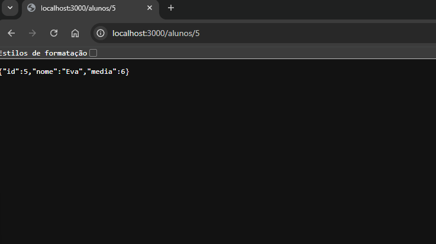

# Desafio backend Geração Tech 3.0 - Servidor Express.js

## 📝 Informações do Projeto

Título: Servidor Express.js para Gerenciamento de Alunos
Autor: Weber Fernandes da Silva
Data: 20/01/2026

## 📖 Descrição

O projeto é um desafio backend da Geração Tech 3.0. O servidor responde a requisições GET para retornar informações de alunos com base no ID fornecido na URL.

## 📋 Pré-requisitos

- [Node.js](https://nodejs.org/) (versão 14 ou superior)
- npm (geralmente vem instalado com o Node.js)

## 🚀 Instalação

1. Instale as dependências do projeto:
```bash
npm install
```

Isso instalará o Express e todas as outras dependências listadas no `package.json`.

## ▶️ Como Rodar o Servidor

Para iniciar o servidor em modo de desenvolvimento, execute:

```bash
npm run dev
```

Ou alternativamente:

```bash
npm start
```

O servidor iniciará e estará disponível em:
```
http://localhost:3000/alunos/
```

Você verá a mensagem no terminal:
```
Servidor rodando em http://localhost:3000/alunos/
```

## 📍 Rotas Disponíveis

### GET /alunos/:id
Retorna os dados de um aluno específico pelo ID.

**Exemplo de requisição:**
```bash
GET http://localhost:3000/alunos/1
```

**Exemplo de resposta (aluno encontrado):**
```json
{ "id": 1, "nome": "Ana", "media": 8 }
```

**Resposta (aluno não encontrado):**
```
Aluno não encontrado
```

## 🛠️ Tecnologias Utilizadas

- **Node.js** - Ambiente de execução JavaScript
- **Express.js** - Framework web para Node.js
- **ES Modules** - Sintaxe moderna de importação/exportação

## 📂 Estrutura do Projeto

```
Desafio-20-01-2026/
├── server.js          # Arquivo principal do servidor
├── package.json       # Configurações e dependências do projeto
├── README.md          # Este arquivo
└── screenshots/       # Imagens do projeto em execução
```

## 📸 Screenshots

### Servidor em Execução


*Demonstração do servidor respondendo a uma requisição GET `/alunos/5` com sucesso.*

## 🔧 Solução de Problemas

### Erro: "Cannot find module 'express'"
Execute `npm install` para instalar as dependências.

### Erro: "Port 3000 is already in use"
A porta 3000 já está sendo usada por outro processo. Você pode:
- Encerrar o processo que está usando a porta
- Alterar a porta no arquivo `server.js` (linha 3)

### Servidor não inicia
Verifique se:
1. O Node.js está instalado corretamente: `node --version`
2. As dependências foram instaladas: `npm install`
3. Não há erros de sintaxe no `server.js`

## 📝 Notas

- O servidor usa a porta **3000** por padrão
- Os dados dos alunos estão armazenados em memória (serão perdidos ao reiniciar)
- Certifique-se de ter o Node.js instalado antes de executar o projeto
